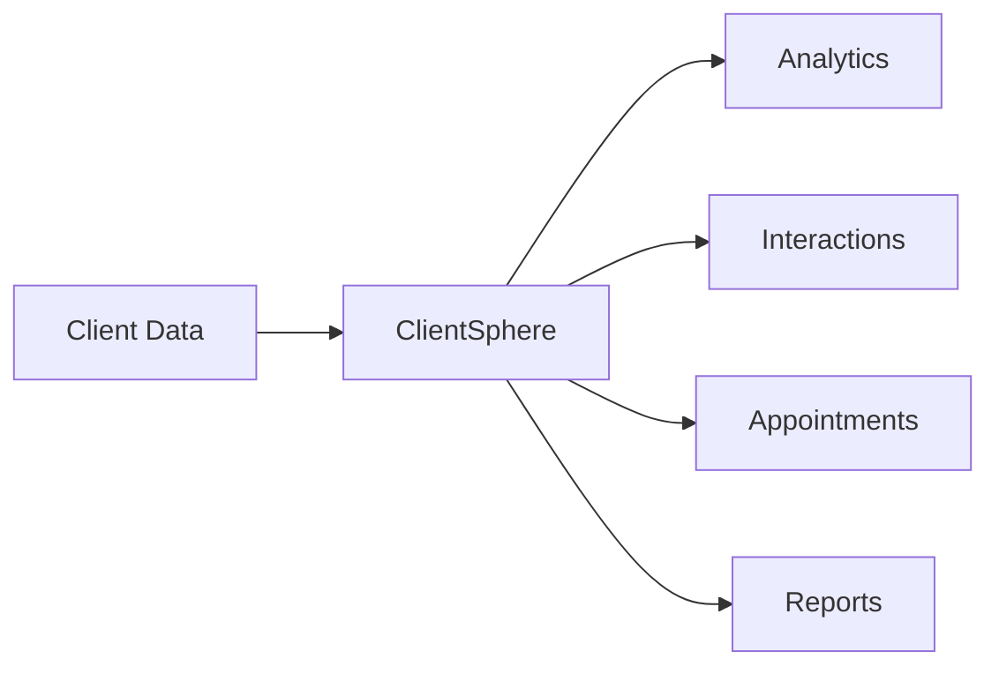
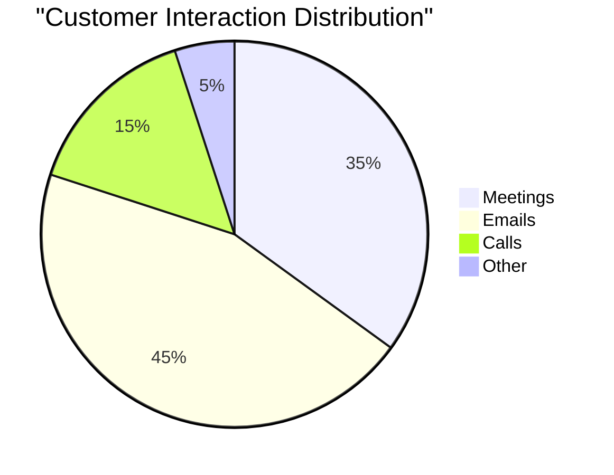
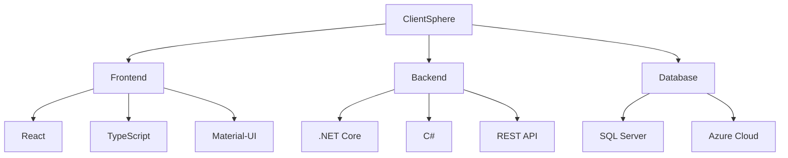
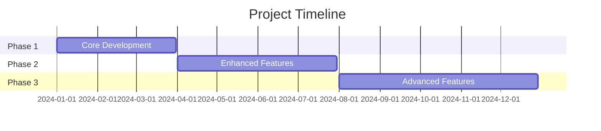
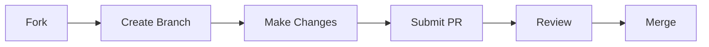

```

⚡ CLIENTSPHERE ⚡
      ┌────────────╮    ┌────────────┐
     /│           /│   /            /│
    / │          / │  /            / │
   ┌────────────┐  │ ┌────────────┐  │
   │  ∎∎∎∎∎∎∎∎  │  │ │  ⬡⬡⬡⬡⬡⬡││
   │  ⚉    ⚉  │ /  │  ⚇    ⚇  │ /
   │    CRM    │/   │  SPHERE   │/
   └────────────┘    └────────────┘
        \     ⟱     ⟱     /
         \    ⟱     ⟱    /
          \   ⟱     ⟱   /
           \  ⟱     ⟱  /
        ┌───────────────────┐
        │   CLIENTSPHERE    │
        │    ◉ ◉ ◉ ◉ ◉   │
        └───────────────────┘
```


# ClientSphere 🌐

> Your complete sphere of client relationships, all in one place. - (in planning phase)

[](https://opensource.org/licenses/MIT)
[]()
[]()

## 📊 Overview

ClientSphere is a modern, intuitive CRM platform that revolutionizes how businesses manage client relationships. Built with .NET Core and React, it provides a seamless experience for tracking customer interactions, managing appointments, and analyzing relationship metrics.



## 🌟 Features

- **Customer Management**
  - Comprehensive client profiles
  - Interaction history tracking
  - Document management
  - Custom fields support

- **Interaction Tracking**
  - Meeting notes
  - Email integration
  - Call logs
  - Task management

- **Analytics & Reporting**


## 🚀 Quick Start

```bash
# Clone the repository
git clone https://github.com/yourusername/clientsphere.git

# Navigate to the project directory
cd clientsphere

# Install dependencies
dotnet restore
cd ClientApp && npm install

# Run the application
dotnet run
```

## 🛠 Technology Stack



## 📱 Screenshots

| Dashboard | Client Profile | Analytics |
|-----------|---------------|-----------|
|  |  |  |

## 🗺 Project Roadmap

- **Phase 1: Core Features** ✅
  - Basic CRUD operations
  - Authentication system
  - Client profiles

- **Phase 2: Enhanced Features** 🚧
  - Email integration
  - Calendar sync
  - Custom reporting

- **Phase 3: Advanced Features** 📋
  - AI-powered insights
  - Mobile app
  - API marketplace

## 💻 Usage Example

```csharp
// Create a new client
var client = new Client
{
    Name = "Acme Corp",
    Industry = "Technology",
    ContactPerson = "John Doe",
    Email = "john@acmecorp.com"
};

await clientRepository.AddAsync(client);

// Track an interaction
var interaction = new Interaction
{
    ClientId = client.Id,
    Type = InteractionType.Meeting,
    Notes = "Discussed Q4 strategy",
    Date = DateTime.Now
};

await interactionRepository.AddAsync(interaction);
```

## 📊 Performance Metrics




---

## 📫 Contact & Connect
- 💻 GitHub: [ailynux](https://github.com/ailynux)
- 💼 LinkedIn: [Ailyn Diaz](https://www.linkedin.com/in/ailyndiaz01)
- 🌐 Personal Website: [AilynDev](https://ailynux.github.io/)

---

## 🤝 Contributing

I welcome contributions! Please see the [Contributing Guidelines](CONTRIBUTING.md) for details.



## 📄 License

This project will be licensed under the MIT License - see the [LICENSE.md](LICENSE.md) file for details.

---
Made with ❤️
